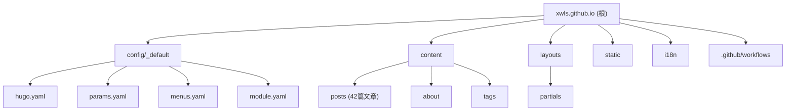

# CLAUDE.md - xwls.github.io

## 项目愿景

Hugo 静态博客站点，基于 [PaperMod](https://github.com/adityatelange/hugo-PaperMod) 主题，用于记录技术学习与分享。博客内容涵盖后端开发、云原生、数据库、大数据等多个技术领域。

## 架构总览

```
xwls.github.io/
├── config/_default/    # Hugo 配置文件（YAML 格式）
├── content/            # 博客内容（Markdown）
│   ├── posts/          # 文章目录
│   ├── about/          # 关于页面
│   ├── archives.md     # 归档页
│   └── search.md       # 搜索页
├── layouts/            # 自定义布局模板
│   └── partials/       # 局部模板
├── static/             # 静态资源
├── i18n/               # 国际化翻译
├── public/             # 构建输出（已忽略）
└── .github/workflows/  # CI/CD 配置
```

## 模块结构图



## 模块索引

| 模块路径 | 职责 | 入口文件 | 配置存在 |
|----------|------|----------|----------|
| `config/_default/` | Hugo 站点配置 | `hugo.yaml` | 是 |
| `content/` | 博客内容管理 | `posts/` | - |
| `layouts/` | 自定义模板覆盖 | `partials/extend_head.html` | - |
| `static/` | 静态资源 | `favicon.svg` | - |
| `i18n/` | 国际化翻译 | `zh-Hans.yaml` | - |
| `.github/workflows/` | CI/CD 自动部署 | `hugo.yml` | - |

## 运行与开发

### 环境要求

- Hugo Extended >= 0.154.5
- Go >= 1.23 (用于 Hugo Modules)
- Git

### 本地开发

```bash
# 克隆仓库
git clone https://github.com/xwls/xwls.github.io.git
cd xwls.github.io

# 启动本地开发服务器
hugo server -D

# 构建生产版本
hugo --gc --minify
```

### 新建文章

```bash
hugo new posts/my-new-post.md
```

文章 Front Matter 模板：

```yaml
---
title: "文章标题"
date: 2024-01-01T00:00:00+08:00
categories:
- 分类名称
tags:
- 标签1
- 标签2
summary: 文章摘要
---
```

## 部署配置

项目支持多平台自动部署：

| 平台 | 配置文件 | 部署 URL |
|------|----------|----------|
| GitHub Pages | `.github/workflows/hugo.yml` | https://xwls.github.io |
| Netlify | `netlify.toml` | https://xwls.netlify.app |
| Vercel | `vercel.json` + `build.sh` | https://xwls.vercel.app |

## 主题配置

使用 Hugo Modules 引入 PaperMod 主题：

```yaml
# config/_default/module.yaml
imports:
- path: github.com/adityatelange/hugo-PaperMod
```

主要特性配置 (`config/_default/params.yaml`)：
- 自动主题切换 (light/dark/auto)
- 阅读时间显示
- 代码复制按钮
- 字数统计
- 目录导航 (TOC)
- Fuse.js 搜索

## 测试策略

本项目为纯静态站点，无单元测试。质量保证依赖：
- Hugo 构建时的错误检查
- CI/CD 流水线构建验证
- 本地 `hugo server` 预览

## 编码规范

### 内容规范

1. 文章使用 Markdown 格式
2. 文件名使用英文小写，单词间用 `-` 连接
3. 必须包含 `title`、`date`、`categories`、`tags` 等 Front Matter
4. 代码块必须指定语言类型

### 配置规范

1. 配置文件使用 YAML 格式
2. 配置按功能分离到独立文件

## AI 使用指引

### 常见任务

1. **新建文章**: 在 `content/posts/` 创建 `.md` 文件，参考现有文章格式
2. **修改菜单**: 编辑 `config/_default/menus.yaml`
3. **修改主题参数**: 编辑 `config/_default/params.yaml`
4. **添加自定义样式/脚本**: 在 `layouts/partials/` 添加覆盖模板

### 关键文件

- 主配置: `config/_default/hugo.yaml`
- 主题参数: `config/_default/params.yaml`
- 菜单配置: `config/_default/menus.yaml`
- 构建脚本: `build.sh` (Vercel)

### 注意事项

- `themes/` 目录已被 `.gitignore` 忽略，主题通过 Hugo Modules 管理
- `public/` 为构建输出，不要手动修改
- 部署配置需保持 Hugo 版本一致 (当前: 0.154.5)

---

## 变更记录 (Changelog)

| 日期 | 变更内容 |
|------|----------|
| 2026-01-16 | 初始化 CLAUDE.md 文档 |
