+++
date = '2026-01-10T10:00:00+08:00'
draft = false
title = 'Git 版本控制完全指南'
summary = '从入门到精通的 Git 使用教程，涵盖基础命令到高级技巧'
tags = ['Git', '版本控制', '开发工具']
categories = ['技术教程']
+++

# Git 版本控制完全指南

> "任何傻瓜都能写出计算机能理解的代码。优秀的程序员编写人类能理解的代码。" —— Martin Fowler

## 前言

无论你是独立开发者还是团队协作，掌握 Git 都是必不可少的技能。本文将带你从零开始，~~逐步~~系统地学习 Git 的使用。

---

## 目录

1. [Git 简介](#git-简介)
2. [安装与配置](#安装与配置)
3. [基础命令](#基础命令)
4. [分支管理](#分支管理)
5. [远程仓库](#远程仓库)
6. [高级技巧](#高级技巧)

---

## Git 简介

Git 由 **Linus Torvalds** 于 2005 年创建，最初是为了管理 Linux 内核开发。它具有以下特点：

- [x] 分布式架构
- [x] 强大的分支管理
- [x] 高效的数据存储
- [ ] 图形界面友好（需要第三方工具）

### 工作区域

Git 有三个主要的工作区域：

| 区域 | 英文名 | 说明 |
|:---:|:---:|:---|
| 工作区 | Working Directory | 实际操作的目录 |
| 暂存区 | Staging Area | 临时存放改动 |
| 仓库 | Repository | 存放所有版本数据 |

## 安装与配置

### 安装 Git

在不同操作系统上安装 Git：

#### macOS

```bash
# 使用 Homebrew 安装
brew install git

# 或者安装 Xcode Command Line Tools
xcode-select --install
```

#### Ubuntu/Debian

```bash
sudo apt update
sudo apt install git
```

#### Windows

从 [Git 官网](https://git-scm.com/) 下载安装包，或使用 `winget`：

```powershell
winget install Git.Git
```

### 初始配置

安装完成后，需要设置用户信息[^1]：

```bash
# 设置用户名
git config --global user.name "Your Name"

# 设置邮箱
git config --global user.email "your.email@example.com"

# 设置默认编辑器
git config --global core.editor "code --wait"

# 查看所有配置
git config --list
```

## 基础命令

### 创建仓库

```bash
# 初始化新仓库
git init

# 克隆远程仓库
git clone https://github.com/user/repo.git
```

### 日常工作流

下面是一个典型的 Git 工作流程：

```mermaid
graph LR
    A[修改文件] --> B[git add]
    B --> C[git commit]
    C --> D[git push]
```



常用命令速查：

```bash
# 查看状态
git status

# 添加文件到暂存区
git add <file>        # 添加指定文件
git add .             # 添加所有文件
git add -p            # 交互式添加

# 提交更改
git commit -m "提交信息"
git commit -am "跳过 add 直接提交"  # 仅对已跟踪文件有效

# 查看历史
git log
git log --oneline --graph --all
```

### 撤销操作

| 场景 | 命令 | 说明 |
|-----|------|-----|
| 撤销工作区修改 | `git checkout -- <file>` | 危险操作！ |
| 撤销暂存 | `git reset HEAD <file>` | 保留工作区 |
| 撤销提交 | `git reset --soft HEAD~1` | 保留更改 |
| 彻底撤销 | `git reset --hard HEAD~1` | ==危险操作！== |

> ⚠️ **警告**：`git reset --hard` 会永久删除未提交的更改，请谨慎使用！

## 分支管理

分支是 Git 最强大的功能之一。

### 分支操作

```bash
# 查看分支
git branch          # 本地分支
git branch -a       # 所有分支

# 创建分支
git branch feature-x

# 切换分支
git checkout feature-x
# 或使用新命令
git switch feature-x

# 创建并切换
git checkout -b feature-y
git switch -c feature-y

# 删除分支
git branch -d feature-x   # 安全删除
git branch -D feature-x   # 强制删除
```

### 合并策略

1. **Fast-forward 合并**
   ```bash
   git merge feature-x
   ```

2. **三方合并**（创建合并提交）
   ```bash
   git merge --no-ff feature-x
   ```

3. **变基合并**
   ```bash
   git rebase main
   ```

### 解决冲突

当合并产生冲突时，Git 会在文件中标记冲突区域：

```
<<<<<<< HEAD
当前分支的内容
=======
要合并的分支内容
>>>>>>> feature-x
```

解决步骤：
1. 手动编辑冲突文件
2. 删除冲突标记
3. `git add <file>`
4. `git commit`

## 远程仓库

### 远程操作

```bash
# 添加远程仓库
git remote add origin https://github.com/user/repo.git

# 查看远程仓库
git remote -v

# 推送到远程
git push -u origin main

# 拉取更新
git pull origin main
# 等同于
git fetch origin && git merge origin/main
```

### SSH 配置

为了避免每次输入密码，建议配置 SSH[^2]：

```bash
# 生成 SSH 密钥
ssh-keygen -t ed25519 -C "your.email@example.com"

# 添加到 ssh-agent
eval "$(ssh-agent -s)"
ssh-add ~/.ssh/id_ed25519

# 复制公钥
cat ~/.ssh/id_ed25519.pub
```

## 高级技巧

### Git Stash

临时保存工作进度：

```bash
# 保存当前工作
git stash
git stash save "工作描述"

# 查看 stash 列表
git stash list

# 恢复工作
git stash pop         # 恢复并删除
git stash apply       # 仅恢复

# 删除 stash
git stash drop stash@{0}
git stash clear       # 清空所有
```

### Git Bisect

二分查找定位 bug：

```bash
git bisect start
git bisect bad              # 当前版本有 bug
git bisect good v1.0.0      # 已知正常的版本
# Git 会自动切换到中间版本
# 测试后标记 good 或 bad
git bisect good  # 或 git bisect bad
# 重复直到找到问题提交
git bisect reset            # 结束查找
```

### 有用的别名

在 `~/.gitconfig` 中添加：

```ini
[alias]
    st = status
    co = checkout
    br = branch
    ci = commit
    lg = log --oneline --graph --all --decorate
    unstage = reset HEAD --
    last = log -1 HEAD
    visual = !gitk
```

## 总结

本文介绍了 Git 的核心概念和常用命令：

- **基础操作**：`init`、`add`、`commit`、`status`、`log`
- **分支管理**：`branch`、`checkout`/`switch`、`merge`、`rebase`
- **远程协作**：`remote`、`push`、`pull`、`fetch`
- **高级技巧**：`stash`、`bisect`、别名配置

> 💡 **提示**：熟练使用 Git 需要大量练习，建议在实际项目中多加应用。

---

## 参考资源

- [Pro Git 中文版](https://git-scm.com/book/zh/v2)
- [Git 官方文档](https://git-scm.com/doc)
- [GitHub Git 速查表](https://education.github.com/git-cheat-sheet-education.pdf)

[^1]: 这些配置会保存在 `~/.gitconfig` 文件中。
[^2]: SSH 密钥需要添加到 GitHub/GitLab 的账户设置中。

---

*本文最后更新于 2026 年 1 月*